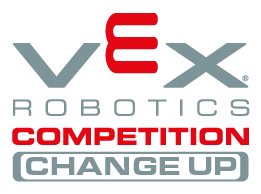
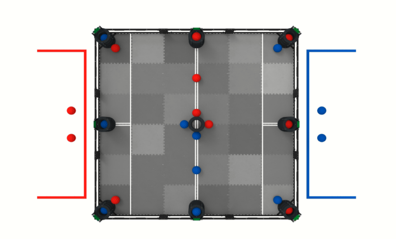

# Change Up Matches

VEX Robotics Competition Change Up is played on a 12’x12’ square field configured as seen below. Two (2) Alliances - one (1) “red” and one (1) “blue” - composed of two (2) Teams each, compete in Matches consisting of a fifteen second (0:15) Autonomous Period, followed by a one minute and forty-five second (1:45) Driver Controlled Period. The object of the game is to attain a higher score than the opposing Alliance by Scoring Balls and Connecting Rows

An Autonomous Win Point is awarded to any Alliance that completes a Connected Row using their Alliance Home Row at the end of the Autonomous Period.
A point bonus is awarded to the Alliance that has the most points at the end of the Autonomous Period.

The VEX Robotics Competition Change Up field consists of the following:

* Thirty-two (32) Balls
* Sixteen (16) red Balls, including two (2) used as Preloads by the red Alliance
* Sixteen (16) blue Balls, including two (2) used as Preloads by the blue Alliance
* Nine (9) Goals, used for Scoring Balls

Alliance Station – The designated regions where the Drive Team Members must remain for the duration of the Match.

Autonomous Bonus - A point bonus of six (6) points awarded to the Alliance that has earned the most points at the end of the Autonomous Period.

Note: If the Autonomous Period ends in a tie, including a zero-to-zero tie, each Alliance will receive an Autonomous Bonus of three (3) points.

Autonomous Line – The pair of white tape lines that run across the center of the field. Robots may not contact the foam field tiles on the opposite Alliance’s side of the Autonomous Line during the Autonomous Period.

Owned - A Goal status. A Goal is considered Owned by an Alliance if its colored Ball is the vertically highest Scored Ball in that Goal.

Scored - A Ball status. A Ball is considered Scored in a Goal if it is not touching a Robot of the same color as the Ball and meets all of the following criteria.

* The Ball is fully or partially within the outer edge of the Goal.
* The Ball is fully below the upper edge of the Goal.
* The Ball is not contacting the foam tiles outside of the Goal.

## Scoring

A Ball Scored in a Goal is worth one (1) point for the Alliance of the color of the Ball

* A Connected Row is worth six (6) points for that Alliance.
* The winner of the Autonomous Bonus receives a six (6) point bonus. In the case of a tie, both Alliances receive a three (3) point bonus
