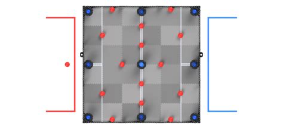

# Robot Skills Challenge

In this challenge, Teams will compete in a Match lasting a maximum of sixty seconds (1:00) in an effort to score as many points as possible. These Matches consist of Driving Skills Matches, which will be entirely driver controlled, and Programming Skills Matches, which will be autonomous with no human interaction. Teams will be ranked based on their combined score in the two types of Matches.

The playing field will have Field Elements setup exactly the same as a normal VEX Robotics Competition Change Up Match, however, the Balls will start as displayed below.

## Game Definitions

### Driving Skills Match

A Driving Skills Match consists of a sixty second (1:00) Driver Controlled Period. There is no Autonomous Period.

### Programming Skills Match

A Programming Skills Match consists of a sixty second (1:00) Autonomous Period. There is no Driver Controlled Period.

### Robot Skills Match

A Driving Skills Match or Programming Skills Match Skills Stop Time – The time remaining in a Robot Skills Match when a Team ends the Match early. If a Team does not end the Match early, they receive a default Skills Stop Time of 0.

* The moment when the Match ends early is defined as the moment when the Robot is “disabled” by the field control system. See the “Skills Stop Time” section for more details.
* If a V5 Robot Brain or Tournament Manager display is being used for field control, then the Skills Stop Time is the time shown on the display when the Match is ended early (i.e. in 1-second increments)
* If a VEXnet Competition Switch is being used for field control, in conjunction with a manual timer that counts down to 0 with greater accuracy than 1-second increments, then the time shown on the timer should be rounded up to the nearest second. For example, if the Robot is disabled and the stopwatch shows 25.2 seconds, then the Skills Stop Time should be recorded as 26
