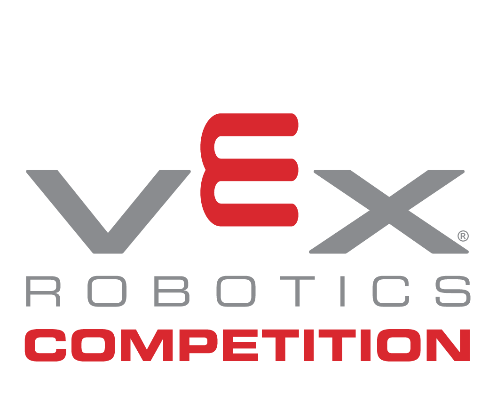

# Vex Robotics

VEX Robotics is educational robotics for everyone. VEX solutions span all levels of both formal and informal education with accessible, scalable, and affordable solutions. Beyond science and engineering principles, VEX encourages creativity, teamwork, leadership, and problem solving among groups. It allows educators of all types to engage and inspire the STEM problem solvers of tomorrow!

At VEX, we envision a world where every student has the opportunity to be inspired by the excitement of hands-on, minds-on STEM learning and the feeling of creating something with technology. Here are some other amazing effects of teaching and learning with educational robotics

[Find out more about Vex Robotics](https://www.vexrobotics.com/)
